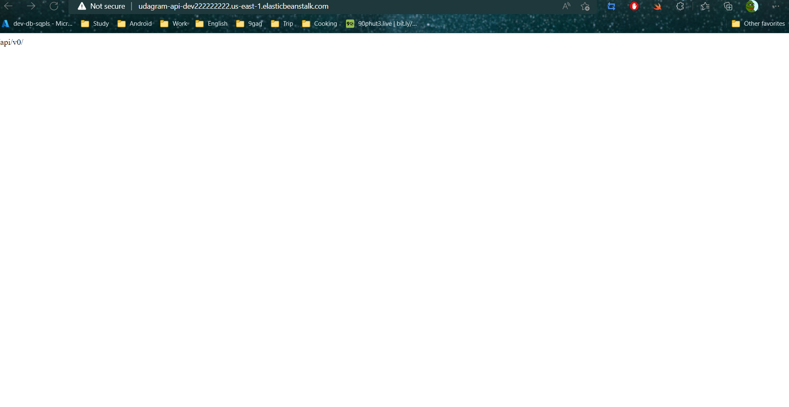
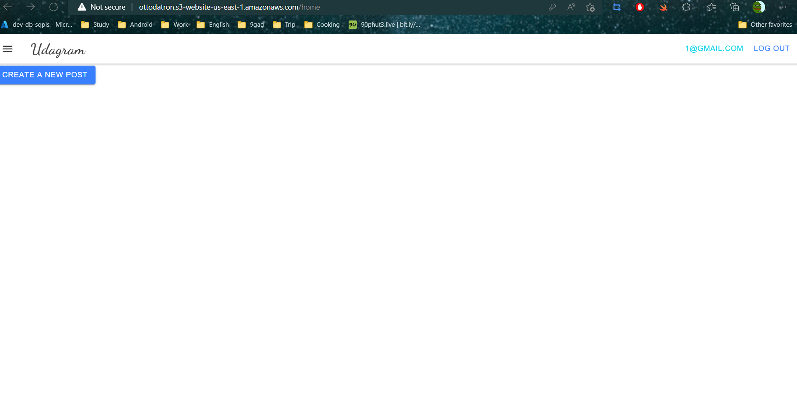
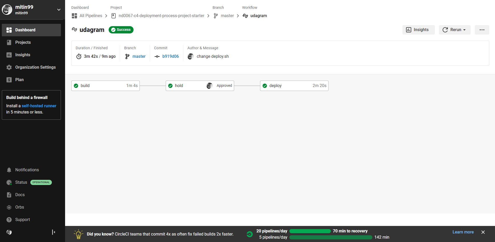

# Hosting a Full-Stack Application


# Udagram

This application is provided to you as an alternative starter project if you do not wish to host your own code done in the previous courses of this nanodegree. The udagram application is a fairly simple application that includes all the major components of a Full-Stack web application.


## Dependencies


The dependencies list can be found [here](doc/Application_dependencies.md)


## Installation

Provision the necessary AWS services needed for running the application:

1. In AWS, provision a publicly available RDS database running Postgres. [picture](doc/picture/RDS/db2.png)
1. In AWS, provision a s3 bucket for hosting the uploaded files. [picture](doc/picture/S3/s32.png)
1. Export the ENV variables needed or use a package like [dotnev](https://www.npmjs.com/package/dotenv)/.
1. From the root of the repo, navigate udagram-api folder `cd starter/udagram-api` to install the node_modules `npm install`. After installation is done start the api in dev mode with `npm run dev`.
1. Without closing the terminal in step 1, navigate to the udagram-frontend `cd starter/udagram-frontend` to intall the node_modules `npm install`. After installation is done start the api in dev mode with `npm run start`.

## Documentation
The "doc" folder contains the documentation for:
- The picture of the working CircleCI, EB, RDS, S3.
- The diagrams for CI and infrastructure
- The documentation for Application dependencies, Infrastructure description and Pipeline description.
## Testing

This project contains two different test suite: unit tests and End-To-End tests(e2e). Follow these steps to run the tests.
```
1. `cd starter/udagram-frontend`
1. `npm run test`
1. `npm run e2e`
```

There are no Unit test on the back-end

### Unit Tests:

Unit tests are using the Jasmine Framework.

### End to End Tests:

The e2e tests are using Protractor and Jasmine.

## Built With

- [Angular](https://angular.io/) - Single Page Application Framework
- [Node](https://nodejs.org) - Javascript Runtime
- [Express](https://expressjs.com/) - Javascript API Framework

## License

[License](LICENSE.txt)

## Result
This is some picture of the project. You can see more in Doc/Picture folder

- Backend server in EB [link](http://udagram-api-dev222222222.us-east-1.elasticbeanstalk.com/)


- Static web frontend in S3 [link](http://ottodatron.s3-website-us-east-1.amazonaws.com)


- CircleCI success deployment

