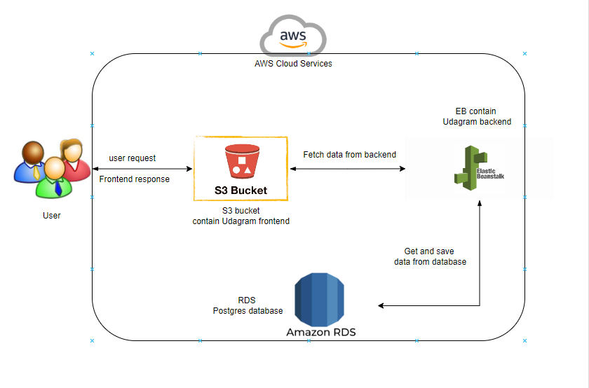

## Project Infrastructure

### AWS
#### RDS Postgres
This project uses AWS RDS Postgres as database for storing and getting data.

Database endpoint: `database-otto.cox3x3phlckn.us-east-1.rds.amazonaws.com`

#### Elastic Beanstalk
The application backend server is deployed on AWS Elastic Beanstalk service.

EB URL: `udagram-api-dev222222222.us-east-1.elasticbeanstalk.com`

#### S3 Bucket
The frontend application is stored and deployed in AWS S3 Bucket.

Bucket website endpoint: `http://ottodatron.s3-website-us-east-1.amazonaws.com`

The project can be accessed from the above URL.
