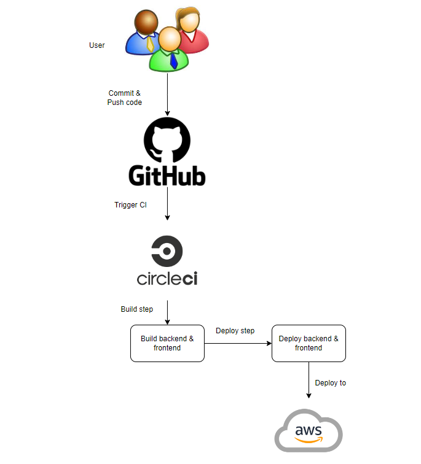

## Project Pipeline

### Continuous Integration
#### GitHub
This project's GitHub repository is linked to the CircleCI. When user commit and push new code to the remote repository, the pipeline will automatically running.

#### CircleCI
CircleCI reads the `.circleci/config.yml` file and run the CI steps.
There are 2 phases: build phase and deploy phase. Between them there is a hold phase, which need the author to approve to continue to deploy phase.

1. Build: 
    - Spin up environment
    - Preparing environment variables
    - Install Node.js 14.15
    - Checkout code
    - Install Front-End Dependencies
    - Install API Dependencies
    - Front-End Build
    - API Build
2. Deploy
    - Spin up environment
    - Preparing environment variables
    - Install Node.js 14.15
    - Setting Up Elastic Beanstalk CLI
    - Install AWS CLI - latest
    - Configure AWS Access Key ID
    - Checkout code
    - Deploy App